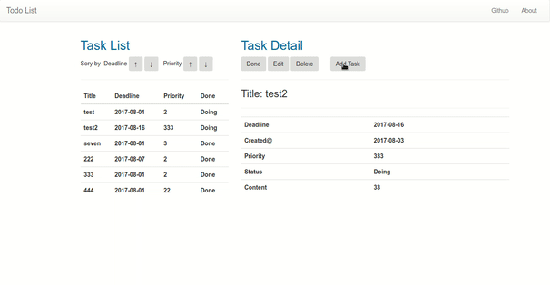
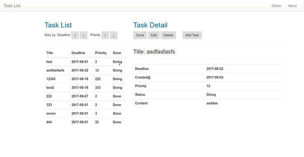
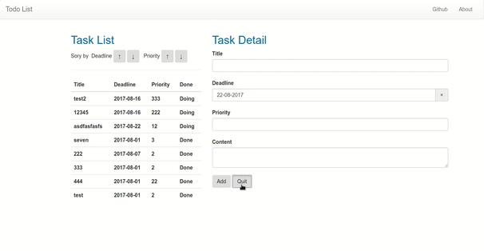
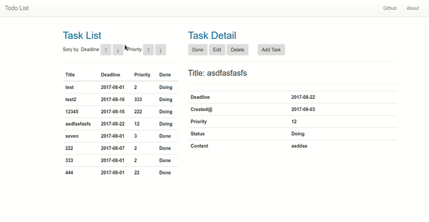

## Features
- Add a task 
- Delete a task 
- Done a task 
- Edit a task 
- Sort tasks 

## Steps to Runserver
### Configure Database
- Install PostSQL, [https://www.postgresql.org/](https://www.postgresql.org/)
- Edit settings.py
```
DATABASES = {
    'default': {
        'ENGINE': 'django.db.backends.postgresql_psycopg2',
        'NAME':'postgres', ## name of your database
        'USER': 'postgres', ## user of your database
        'PASSWORD': 'postgres', ## your password
        'HOST': '',
        'PORT': '5432',
    }
}
```

### Install Modules and Dependencies
- `cd backend`
- `sudo pip install -r requirements.txt`
- `cd ../frontend`
- `sudo npm install`
- `sudo webpack`
- `sudo npm run start`

## Others
- Note:[https://today2tmr.com/en/2017/08/04/notes-for-todo-list-project-with-django-and-react/](https://today2tmr.com/en/2017/08/04/notes-for-todo-list-project-with-django-and-react/)
